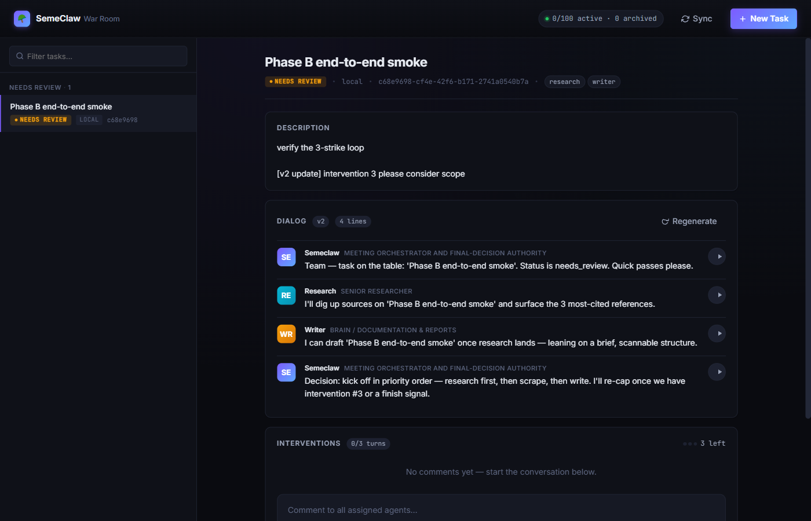
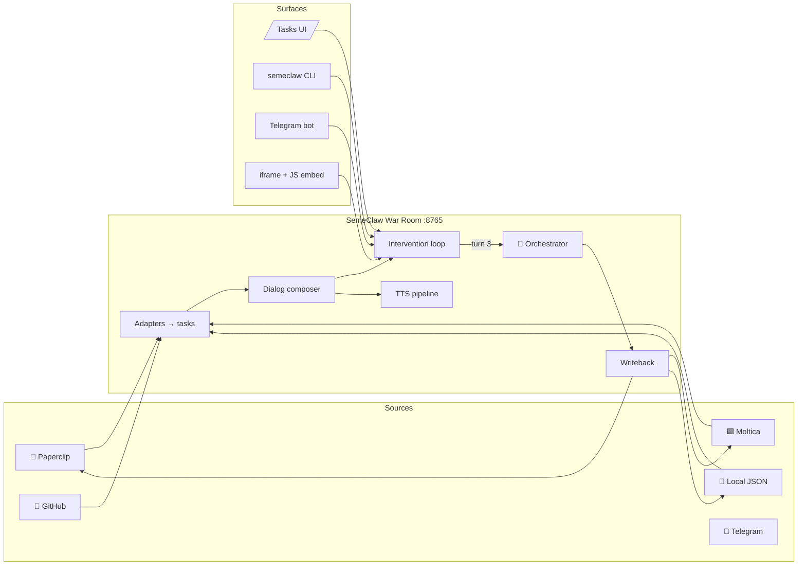

<div align="center">

# 🪖 SemeClaw — Open-Source AI War Room

**Every task in your stack becomes a multi-agent meeting you can join, interrupt, and steer — until the orchestrator commits a final decision back to the source.**

[](./pyproject.toml)
[](https://www.python.org/)
[](https://fastapi.tiangolo.com/)
[](./LICENSE.md)
[](https://semeclaw.fly.dev/tasks)
[](./AGENTS.md)

</div>

---

## The problem

Every team using AI today drowns in **disconnected task systems**.
Paperclip has tasks. Moltica has tasks. GitHub has issues. Claude Code spins
up its own. Each tool ships its own dashboard, its own opinion, its own
silo — and **none of them let your AI agents actually argue with each
other and reach a decision a human can sign off on**.

You end up with:

- A pile of TODOs nobody reads.
- LLM "summaries" that vanish into chat history.
- No audit trail from *"agent suggested X"* to *"task is now done"*.
- No way for a human to **interrupt the agents** mid-thought and have the
  plan adjust without restarting from scratch.

## What SemeClaw does

SemeClaw is a **self-hosted War Room** that:

1. **Pulls tasks** from every system you connect (Paperclip, Moltica, GitHub,
   Obsidian, Telegram, plain JSON files, your own adapter).
2. **Composes a multi-agent dialog** for each task — Research, Writer,
   Scraper, Coder, plus the SemeClaw **orchestrator**. Works with **zero
   API keys** (deterministic templates) and upgrades to free OpenRouter
   models when you add a key.
3. Lets you **intervene up to 3 times** per dialog from the UI, the CLI,
   or Telegram. The agents reply each turn.
4. On turn 3 the **orchestrator decides** — patches the task (status,
   description, assignment), composes dialog v2, and **writes the patch
   back to the source system**.
5. Plays every line through **ElevenLabs** (or free `edge-tts`) so the
   meeting is auditable as audio, not just text.

> **Zero-key mode is real.** Dialog generation, web search, TTS, orchestrator
> decisions — all have free fallbacks (deterministic templates,
> DuckDuckGo HTML, edge-tts, rule-based patches). Add keys only when you
> want to upgrade quality.

---

<div align="center">
  
  <p><em>Live at <a href="https://semeclaw.fly.dev/tasks">semeclaw.fly.dev/tasks</a> — task list, multi-agent dialog with per-line audio, 3-strike intervention loop.</em></p>
</div>

---

## ⚡ Three paths from clone to running

Pick the one that fits how you work.

### A — Human, with the CLI (60 seconds)
```bash
git clone https://github.com/DansiDanutz/SemeClaw.git && cd SemeClaw
uv sync
semeclaw doctor          # tells you exactly what's missing (and what's optional)
semeclaw war-room        # http://127.0.0.1:8765
semeclaw tasks sync      # pull from every configured adapter
```

The native engine is the production-safe default. The optional CrewAI adapter
is not installed by default because its current ChromaDB dependency has an
unfixed upstream security advisory. Do not enable `uv sync --extra crewai` on a
network-exposed deployment until CrewAI accepts a patched ChromaDB release.

### B — Autonomous, with an AI coding agent
```bash
git clone https://github.com/DansiDanutz/SemeClaw.git && cd SemeClaw
# Open in Claude Code / Codex / Cursor / Aider, paste:
#   scripts/autonomous-setup-prompt.md
```
The agent reads [**AGENTS.md**](./AGENTS.md), runs `semeclaw doctor --json`,
and configures everything that doesn't need a human decision. Every CLI
command supports `--json` so the agent can parse, not scrape.

### C — Docker
```bash
docker compose up         # binds :8765
```

---

## 🏛 The intervention loop

Every task in SemeClaw flows through this lifecycle:

```
sync → dialog v1
        ├── [user comment 1] → agent replies
        ├── [user comment 2] → agent replies
        └── [user comment 3] → agent replies + 🧭 ORCHESTRATOR DECIDES
                               ├── task patched (status, description, assignment)
                               ├── dialog v2 composed
                               └── writeback → source (paperclip/moltica/local)
```

The orchestrator's decision contract is strict JSON:

```json
{
  "task_patch":   { "status": "needs_review", "description": "...",
                    "assigned_agents": ["research", "writer"] },
  "rationale":    "1-2 sentences for the audit log",
  "dialog_brief": "seed prompt for dialog v2"
}
```

Without an LLM key, a deterministic fallback moves the task to
`needs_review` and appends the latest comment — so **the loop closes
even offline**.

---

## ✨ What's in the box

| Feature | What it does |
|---|---|
| 🎯 **Tasks ingest** | Adapters pull tasks from Paperclip, Moltica, GitHub, Obsidian, local JSON. One source of truth, one tenant. |
| 💬 **Multi-agent dialogs** | 5 core agents (Research, Writer, Scraper, Coder, SemeClaw orchestrator) compose a 6-line meeting per task. |
| 🧭 **3-strike intervention loop** | Comment up to 3× per dialog from UI/CLI/Telegram. Turn 3 triggers an orchestrator decision + writeback. |
| 🔊 **TTS for every line** | `audio_url` on every line. ElevenLabs Flash v2.5 → `edge-tts` fallback. |
| 🪪 **Adapter discovery** | `GET /api/agents/adapters/{id}/agents` — discover the user's *own* agents inside their workspace via env-templated paths. |
| 📨 **Telegram bot** | `POST /api/telegram/webhook` — drive the intervention loop from a chat. `/list`, `/comment`, `<id>: <text>` shorthand. |
| 🛠 **Agent-native CLI** | `semeclaw tasks sync/list/dialog/comment/quota/gc` — every command supports `--json`. |
| 🩺 **Doctor** | `semeclaw doctor [--json]` — connectivity probe with a structured plan-of-action. The autonomous-setup contract. |
| 📦 **Retention + quota** | 100-task cap per tenant, oldest-archived-first GC. `/api/tasks/quota` + `/api/tasks/gc`. |
| 🪟 **Embeddable** | `<iframe>` + `<script>` widget for meetings. `/embed` + `/embed.js`. |
| 🔐 **Bearer auth on writes** | Reads stay open (so embeds work). Writes guarded by `SEMECLAW_API_KEY`. |
| 🐳 **Docker + Fly-ready** | One-line `docker compose up`. Live demo at semeclaw.fly.dev. |

---

## 🔌 Connect any system in 3 ways

### 1 — As a task source (adapter)
Drop a markdown agent definition in `war_room/agents/<name>.md` with YAML
frontmatter. The registry auto-loads it on next start.

```yaml
---
id: my_adapter
name: My Adapter
adapter:
  protocol: http
  base_url_env: MYCO_BASE_URL
  api_key_env:  MYCO_API_KEY
  agents_path:  /v1/workspaces/{workspace_id}/agents
  required_env: [MYCO_BASE_URL, MYCO_API_KEY, MYCO_WORKSPACE_ID]
---
```

Then implement an async generator in `war_room/tasks/sources.py` that yields
task dicts. Documented end-to-end in [**AGENTS.md §4**](./AGENTS.md#4-adding-a-new-task-source-adapter).

### 2 — As a meeting embed
```html
<iframe src="https://semeclaw.your-host.com/embed?meeting=<task_id>"
        style="width:100%;height:720px;border:0;border-radius:12px"
        allow="autoplay"></iframe>
```

### 3 — Via HTTP API
```python
import httpx
c = httpx.Client(base_url="https://semeclaw.your-host.com")

task = c.post("/api/tasks", json={"title": "Investigate latency spike"}).json()
dialog = c.get(f"/api/tasks/{task['task_id']}/dialog").json()

# Comment on it (turn 3 triggers the orchestrator)
c.post(f"/api/tasks/{task['task_id']}/intervene",
       json={"comment": "Focus on the EU region only"})
```

---

## 🏗 Architecture



Detailed diagrams + storage model: [**docs/ARCHITECTURE.md**](./docs/ARCHITECTURE.md).

---

## 📚 Documentation

| Doc | What's in it |
|---|---|
| [**AGENTS.md**](./AGENTS.md) | Spec for AI coding agents to autonomously set up the repo after `git clone`. |
| [**docs/TASKS.md**](./docs/TASKS.md) | Tasks lifecycle, intervention loop, orchestrator contract, writeback handlers. |
| [**docs/API_REFERENCE.md**](./docs/API_REFERENCE.md) | Full HTTP endpoint reference. |
| [**docs/ARCHITECTURE.md**](./docs/ARCHITECTURE.md) | Sequence diagrams, storage model, retention. |
| [**docs/ENHANCEMENTS.md**](./docs/ENHANCEMENTS.md) | Roadmap wish-list. |
| [**CONTRIBUTING.md**](./CONTRIBUTING.md) | Development setup, test strategy, PR rules. |
| [**CHANGELOG.md**](./CHANGELOG.md) | Per-release changes. |

---

## 🔑 Environment variables

The core local system works without these values. Features that are explicitly enabled—such as the authenticated advertiser API—require their listed security configuration.

| Var | Purpose | Default |
|---|---|---|
| `OPENROUTER_API_KEY` | LLM for agents + orchestrator decisions. Without it, deterministic templates fire. | unset |
| `ELEVENLABS_API_KEY` | Premium TTS. Falls back to `edge-tts`. | unset |
| `DLS_TEAM_SUPABASE_URL` + `DLS_TEAM_SUPABASE_SERVICE_ROLE_KEY` | Persistent task storage. Without it, in-memory only. | unset |
| `SUPABASE_JWT_SECRET` | Required server-side to verify advertiser Supabase access tokens; advertiser ownership checks fail closed when unset. | unset |
| `SEMECLAW_API_KEY` | Bearer token for write endpoints. Unset permits writes only for direct loopback requests on a loopback-only deployment. | unset |
| `SEMECLAW_TENANT_ID` | Tenant identifier in manifest + logs. | `default` |
| `SEMECLAW_PUBLIC_URL` | External URL baked into embeds + manifest. | `http://127.0.0.1:8765` |
| `SEMECLAW_TRUSTED_PROXY_CIDRS` | Comma-separated proxy CIDRs allowed to supply `X-Forwarded-For` for per-client rate limiting. | unset |
| `TELEGRAM_BOT_TOKEN` | Enables the Telegram bot. | unset |
| `TELEGRAM_WEBHOOK_SECRET` | Verifies `X-Telegram-Bot-Api-Secret-Token` header. | unset |
| `<ADAPTER>_BASE_URL` / `_API_KEY` / `_WORKSPACE_ID` | Per-adapter creds. Probed by `semeclaw doctor`. | unset |

Full list with examples: [**.env.example**](./.env.example).

---

## 🧰 Maintenance

GitHub Actions run ruff, formatting, the full pytest suite, smoke tests, and
Docker build validation on every PR to `main`. Non-doc changes must bump
`pyproject.toml` and add a changelog entry.

Dependabot checks GitHub Actions weekly. Python dependency updates stay under
the release-managed version/changelog flow so dependency resolution changes are
reviewed with the rest of the shipped package surface. Workflow jobs declare
explicit permissions, cancel superseded branch runs, and use timeouts so failed
automation does not drift silently.

---

## 🗺 Roadmap

| Phase | Status | Scope |
|---|:--:|---|
| **A. Tasks ingest + dialog v1** | ✅ shipped | Adapters, composer, retention. |
| **B. Intervention loop + orchestrator + writeback** | ✅ shipped | 3-strike comments, JSON-strict orchestrator, source patch. |
| **C. Adapter discovery** | ✅ shipped | `/api/agents/adapters/{id}/agents` with env-templated paths. |
| **D. Telegram bot + Tasks UI** | ✅ shipped | Webhook with secret verification, single-page UI with audio. |
| **E. Multi-tenant + Stripe billing** | 🟡 in design | Per-tenant isolation, metered usage. |
| **F. Voice cloning + per-agent override** | ⏳ | Custom voices via ElevenLabs PVC. |
| **G. PDF/SRT/MP4 exports** | ⏳ | Shareable artifacts from any meeting. |

---

## 🤝 Contributing

PRs welcome. Start with [**CONTRIBUTING.md**](./CONTRIBUTING.md) and run
`semeclaw doctor --json` before opening a PR — that's the same gate CI uses.

If you're an AI coding agent reading this, your spec lives in
[**AGENTS.md**](./AGENTS.md). Every CLI command supports `--json`, so you
never need to scrape prose.

---

## 📜 License

[MIT](./LICENSE.md) — © 2026 Dansi Danutz.

Built by [Dansi Danutz](https://github.com/DansiDanutz). Powered by
[FastAPI](https://fastapi.tiangolo.com/), [Supabase](https://supabase.com/),
[OpenRouter](https://openrouter.ai), [ElevenLabs](https://elevenlabs.io/),
and [uv](https://github.com/astral-sh/uv).
