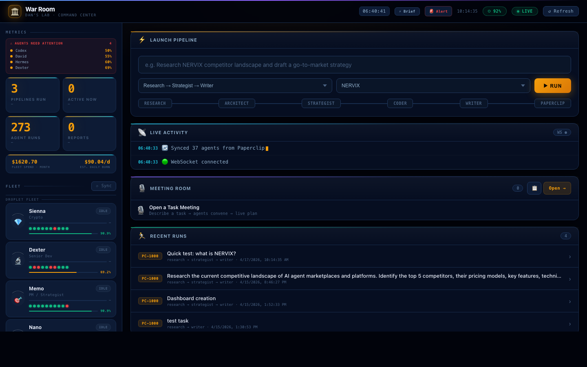
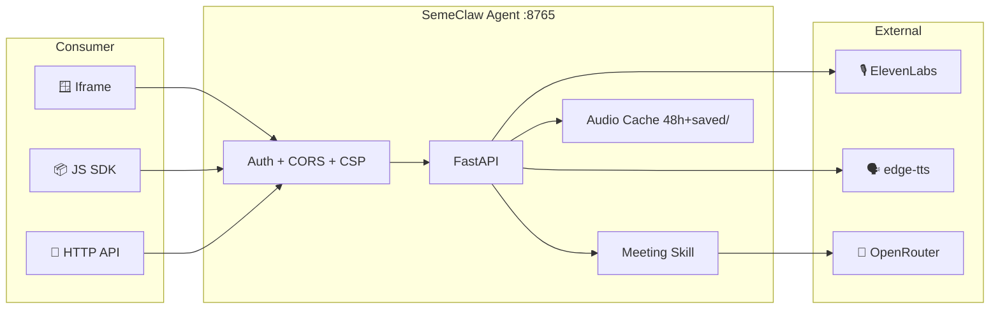

<div align="center">

# 🎭 SemeClaw — Agent-Powered War Room

**Turn any markdown report into a cinematic multi-agent meeting with voice.**
**Embed in any app. Own your AI operations.**

[](./pyproject.toml)
[%20%C2%B7%203.13%20(rec)-blue.svg)](https://www.python.org/)
[](https://fastapi.tiangolo.com/)
[](#license)
[](https://github.com/czl9707/build-your-own-openclaw)

</div>

---

<div align="center">
  
  <p><em>SemeClaw War Room — Live fleet dashboard + agent pipeline + meeting library</em></p>
</div>

---

## ⚡ Quickstart — three paths from clone to running

Pick the one that fits how you work:

### Path A — human, with a CLI (60 seconds)
```bash
curl -fsSL https://raw.githubusercontent.com/DansiDanutz/SemeClaw/main/install.sh | bash
cd ~/SemeClaw
semeclaw setup     # interactive: pick free providers, smoke-test, save
semeclaw doctor    # connectivity check — tells you exactly what's missing
semeclaw war-room  # dashboard at http://127.0.0.1:8765
```

### Path B — autonomous, with an AI coding agent (Claude Code / Codex / Cursor)
```bash
git clone https://github.com/DansiDanutz/SemeClaw.git && cd SemeClaw
# Open the repo in your AI agent and paste the prompt from:
# scripts/autonomous-setup-prompt.md
```
The agent reads [`AGENTS.md`](./AGENTS.md), runs `semeclaw doctor --json`, and
sets up everything that doesn't need a human decision. Works without any API
keys — it'll only ask if you want to plug in optional ones.

### Path C — Docker
```bash
git clone https://github.com/DansiDanutz/SemeClaw.git && cd SemeClaw
docker compose up
```

> **Zero-key mode is real.** Dialog generation, web search, and TTS all have
> free fallbacks (deterministic templates, DuckDuckGo HTML, edge-tts). Add keys
> only when you want to upgrade the quality.

---

## 🚀 What is SemeClaw?

SemeClaw is a **self-hosted, embeddable AI agent** that turns any task report into a **cinematic multi-agent meeting**. Built from the ground up as the AI brain of [NERVIX](https://nervix.ai) and designed for distribution to other Paperclip companies.

Drop it into any web app in 3 ways:
- **HTTP API** — drive it from your backend
- **`<iframe>`** — copy/paste a URL, done
- **JS widget** — `<script>` + `<div data-semeclaw-meeting="…">`

Every meeting includes a **host announcer**, a **conversational orchestrator**, up to **5 specialist agents** with distinct voices, a **2-question interjection budget** for the user, **live recalibration** when the user pushes back, and an **automatic task re-analysis** on close that appends `VERDICT: CORRECT — proceed` (or `NEEDS REVISION`) to the source markdown.

---

## ✨ Features

| Feature | What it does |
|---------|--------------|
| 🎙 **Meeting-as-a-Script** | `meeting_skill.py` parses any markdown report → generates announcer + orchestrator handoffs + agent turns + Dan's closer |
| 🎨 **Two cinematic layouts** | V1 flat compact roster for dev/ops · V2 orbital ring with live-speaker center card for premium demos |
| 🗣 **ElevenLabs Flash v2.5** | Premium voice per speaker · automatic fallback to Microsoft `edge-tts` for non-English or offline |
| 💬 **2-Question budget** | Users can interject mid-meeting; after each Q the meeting **recalibrates** via LLM and continues with a fresh plan |
| 🏁 **Finish → Task Update** | Ends the meeting, appends Q&A to the report `.md`, runs a verification pass, emits `VERDICT:` line |
| 💾 **48h rolling retention + pin-to-save** | Meetings and reports auto-clean after 48h · pin keeps forever |
| 🔌 **Public `/api/agent/manifest`** | Discoverable agent contract — capabilities, endpoints, auth, tenant info |
| 🪟 **iframe + JS SDK** | `/embed` + `/embed.js` — drop into Notion, CMS, NERVIX marketplace, anywhere |
| 🔐 **Bearer auth on writes** | Reads stay open (so embeds work) · writes protected via `SEMECLAW_API_KEY` |
| 🌐 **CORS + CSP configurable** | Allow-list origins + iframe parents via env |
| 🐳 **Docker-ready** | Python 3.13 recommended for deploy parity (3.10+ minimum) + uvicorn + ffmpeg + healthcheck |
| 📎 **Paperclip bridge** | Hook into Paperclip fleet ops today · first-class agent adapter coming in Phase 4 |
| 🛡 **Sentinel** | Fleet health monitor — probes all droplets every 60s, fires Telegram alerts on CPU/RAM/disk thresholds. Runs on :18790 |
| ⚡ **Coordinator** | 8-backend circuit-breaker LLM proxy on :8996. Auto-fails over across Claude / OpenRouter / Ollama / local models |
| 📊 **KPI Tracking** | Daily counters in Supabase (tasks_done, tokens_spent, cost_usd, commits). 18:00 EET digest to Telegram |
| 🎯 **Natural Meetings** | Agents have distinct personalities, debate, react, agree. Variable pacing. ElevenLabs style=0.35 for expression |
| 🔴 **Health Strip** | Live agent health panel with green/orange/red border + 60s polling |
| 💬 **Human-in-loop** | Text + voice interjection during meetings (max 2 replans), Web Speech API |

---

## 🏃 Quickstart

### One-line install (macOS / Linux)

```bash
curl -fsSL https://raw.githubusercontent.com/DansiDanutz/SemeClaw/main/install.sh | bash
```

Or manually:
```bash
git clone https://github.com/DansiDanutz/SemeClaw.git
cd SemeClaw
chmod +x install.sh && ./install.sh
```

### Run the demo (no API keys needed)

```bash
cd ~/SemeClaw
source .venv/bin/activate

# See the War Room agents in action
semeclaw demo

# Start the dashboard
semeclaw war-room
# → http://127.0.0.1:8765
```

### Configure providers for real LLM calls

```bash
# Interactive wizard — auto-detects keys, tests connections
semeclaw init

# Or edit .env directly
cp .env.example .env
# fill in ANTHROPIC_API_KEY, OPENROUTER_API_KEY, ELEVENLABS_API_KEY
```

### Local dev

Requirements:
- Python 3.10+ minimum
- Python 3.13 recommended for parity with Docker/dev deploys

```bash
git clone https://github.com/DansiDanutz/SemeClaw.git
cd SemeClaw
uv sync
```

Verify it's alive:
```bash
curl http://127.0.0.1:8765/api/agent/manifest | jq .version
# "0.7.0"
```

### Legacy setup.sh
```bash
chmod +x setup.sh && ./setup.sh
```

### Docker

```bash
docker build -t semeclaw:0.7.0 .
docker run -p 8765:8765 --env-file .env semeclaw:0.7.0
```

---

## 🏗 Services

| Service | Port | Purpose | Start |
|---------|------|---------|-------|
| War Room Dashboard | 8765 | Main UI + API + WebSocket | `semeclaw war-room` |
| Sentinel | 18790 | Fleet health monitor | `uv run python -m sentinel.sentinel` |
| Coordinator | 8996 | LLM circuit-breaker proxy | `uv run python -m coordinator.coordinator` |
| KPI Collector | — | Redis stream → Supabase | `uv run python -m kpis.collector` |
| KPI Digest | — | Daily 18:00 EET Telegram | cron: `uv run python -m kpis.digest` |

---

## 🔌 Integration Paths

### 1️⃣ Iframe — fastest

```html
<iframe
  src="https://semeclaw.your-host.com/embed?meeting=ops-review.md&v=2&theme=dark"
  style="width:100%;height:720px;border:0;border-radius:12px"
  allow="autoplay"
></iframe>
```

### 2️⃣ JS widget — cleanest for multiple embeds

```html
<script src="https://semeclaw.your-host.com/embed.js" defer></script>
<div data-semeclaw-meeting="quarterly-review.md"
     data-semeclaw-v="2"
     style="width:100%;height:720px"></div>
```

### 3️⃣ HTTP API — full programmatic control

```python
import httpx, os
c = httpx.Client(
    base_url="https://semeclaw.your-host.com",
    headers={"Authorization": f"Bearer {os.environ['SEMECLAW_API_KEY']}"}
)

# list reports
reports = c.get("/api/reports").json()

# generate meeting audio
mp3 = c.get("/api/meeting/audio", params={"name": reports[0]["name"]}).content
open("meeting.mp3", "wb").write(mp3)

# finalize with Q&A — appends to source .md + runs verdict pass
c.post("/api/meeting/finalize", json={
    "name": reports[0]["name"],
    "qa_pairs": [{"question": "How long?", "responder": "GSD", "response": "6 weeks."}],
    "transcript": [...],
})
```

See [**docs/API_REFERENCE.md**](./docs/API_REFERENCE.md) for the full endpoint spec and [**INTEGRATION.md**](./INTEGRATION.md) for integration examples.

---

## 🏗 Architecture



See [**docs/ARCHITECTURE.md**](./docs/ARCHITECTURE.md) for detailed sequence diagrams, storage model, and flow explanations.

---

## 🎛 Meeting Flow

Every meeting follows the same reliable arc:

```
1. 🎙 Narrator announces:
     "Meeting 75f6809d. Subject: ___. Attendees: Dan, David, GSD, Hermes.
      Have a nice meeting."

2. 🏛 Orchestrator (David) opens:
     "Welcome. Today's question: ___. Let's dig in."

3. 🏛 Handoff → 🔬 Agent 1 speaks
4. 🏛 Handoff → 📐 Agent 2 speaks
5. 🏛 Handoff → ✍️ Agent 3 speaks
   ⋮
6. 🏛 Closes: "That gives us what we need. Dan?"
7. 👤 Dan adjourns: "Ship fast, stay sharp. Meeting adjourned."
```

If the user interjects via the **Send** button (max 2 questions):
- LLM picks the best agent to answer
- That agent answers (voiced)
- Orchestrator acknowledges: *"Got it. Recalibrating the plan."*
- Remaining segments are **rewritten** via `/api/meeting/replan` to incorporate the new context
- Meeting continues seamlessly

On **🏁 Finish**:
- Audio stops
- Q&A pairs are appended to the source `.md`
- LLM runs a verification pass
- Source report gets an `## 🔎 Updated Analysis` block ending in `VERDICT: CORRECT — proceed`
- Cached MP3 is invalidated so next playback uses the updated flow

---

## 📁 Project Structure

```
SemeClaw/
├── src/semeclaw/              # Core agent (chat, tools, memory, skills)
│   ├── core/                  # agent loop
│   ├── channel/               # CLI · Telegram · Discord · WebSocket
│   ├── provider/              # LLM adapters (litellm)
│   └── tools/                 # tool registry + builtins
├── war_room/                  # Monetizable surface — the Meeting Room
│   ├── dashboard/
│   │   ├── server.py          # FastAPI app (all public endpoints)
│   │   ├── index.html         # V1 + V2 UI
│   │   └── meeting_skill.py   # Pure module: report → segments
│   ├── research/ saved/       # Reports (48h + pinned)
│   ├── audio/meetings/ saved/ # MP3 cache (48h + pinned)
│   ├── paperclip_bridge.py
│   └── logs/
├── docs/
│   ├── ARCHITECTURE.md
│   ├── API_REFERENCE.md
│   ├── ENHANCEMENTS.md        # Roadmap wish-list
│   └── screenshots/
├── Dockerfile
├── .env.example
├── INTEGRATION.md             # Integration guide for consumers
├── SEMECLAW_AGENT_PLAN.md     # 5-phase product roadmap
├── CLAUDE.md                  # Brief for AI agents working on the repo
└── README.md
```

---

## 🗺 Roadmap

| Phase | Status | Scope |
|-------|:------:|-------|
| **1. Agent contract** | ✅ v0.2.0 | `/api/agent/manifest`, `/embed` + `/embed.js`, CORS, CSP, bearer auth |
| **2. Deploy + CI** | 🟡 Next | Docker image on `ghcr.io`, GitHub Actions, release tags |
| **3. NERVIX marketplace** | ⏳ | Agent card, tenant provisioning, webhook on finalize |
| **4. Paperclip first-class** | ⏳ | Real agent type (not just bridged), bidirectional context |
| **5. Multi-tenant SaaS** | 🔮 | Per-tenant isolation, Stripe metered billing, admin dashboard |

See [**docs/ENHANCEMENTS.md**](./docs/ENHANCEMENTS.md) for the **full wish-list** covering:
- 📥 `POST /api/reports` + webhooks + SSE events
- 🎙 Voice cloning + per-agent overrides + streaming TTS
- 🎭 Theater / Compact / Presentation / 3D cinematic modes
- 📤 PDF/SRT/MP4 exports + share links + OpenGraph previews
- 🔌 Slack/GitHub/Discord/Linear/Notion integrations
- 📊 Prometheus metrics + audit log + cost ledger

---

## 🔑 Environment Variables

| Var | Purpose | Default |
|-----|---------|---------|
| `ELEVENLABS_API_KEY` | Tier-1 voice. Falls back to edge-tts if unset | — |
| `OPENROUTER_API_KEY` | LLM for redirect/replan/finalize | — |
| `SEMECLAW_API_KEY` | Bearer token for write endpoints. Unset = open mode | unset |
| `SEMECLAW_CORS_ORIGINS` | Comma-sep allow-list. `*` for anyone | `*` |
| `SEMECLAW_FRAME_ANCESTORS` | CSP directive for iframe embedding | `*` |
| `SEMECLAW_TENANT_ID` | Tenant identifier in manifest + logs | `default` |
| `SEMECLAW_PUBLIC_URL` | External URL baked into embed.js + manifest | `http://127.0.0.1:8765` |

Full reference: [**.env.example**](./.env.example)

---

## 🧪 API Reference Highlights

| Endpoint | Purpose |
|----------|---------|
| `GET /api/agent/manifest` | Capabilities + endpoints + auth descriptor |
| `GET /api/reports` | List rolling + saved reports |
| `GET /api/meeting/script?name=` | Generate scripted meeting segments |
| `GET /api/meeting/audio?name=` | Generate + cache MP3 of the meeting |
| `POST /api/meeting/redirect` 🔐 | Pick best agent to answer a user question |
| `POST /api/meeting/replan` 🔐 | Rewrite remaining segments given Q&A |
| `POST /api/meeting/finalize` 🔐 | Append Q&A + re-analyze source task |
| `POST /api/meeting/pin` 🔐 | Save both report + meeting MP3 forever |
| `GET /api/tts?text=&speaker=` | Stream MP3 for a given speaker |
| `GET /embed?meeting=&v=1` | Iframe-safe page |
| `GET /embed.js` | Drop-in JS widget |

🔐 = Requires `Authorization: Bearer <SEMECLAW_API_KEY>` when the env var is set.

Full spec → [**docs/API_REFERENCE.md**](./docs/API_REFERENCE.md).

---

## 🏛 Built On

- Built from scratch following the [build-your-own-openclaw](https://github.com/czl9707/build-your-own-openclaw) tutorial
- Powers [NERVIX](https://nervix.ai) — AI agent marketplace
- Uses [ElevenLabs](https://elevenlabs.io/), [OpenRouter](https://openrouter.ai), [FastAPI](https://fastapi.tiangolo.com/), [uv](https://github.com/astral-sh/uv)

---

## 🤝 Contributing

This is currently a private/proprietary repo for Dan's Lab + NERVIX. If you're an AI agent working on the code, start with [**CLAUDE.md**](./CLAUDE.md).

External contributions welcome once we open-source (Phase 5).

---

## 📜 License

Proprietary — © 2026 Dan Semenescu / NERVIX. All rights reserved.

Contact: [seme@kryptostack.com](mailto:seme@kryptostack.com) · [WhatsApp](https://wa.me/40750257337)
