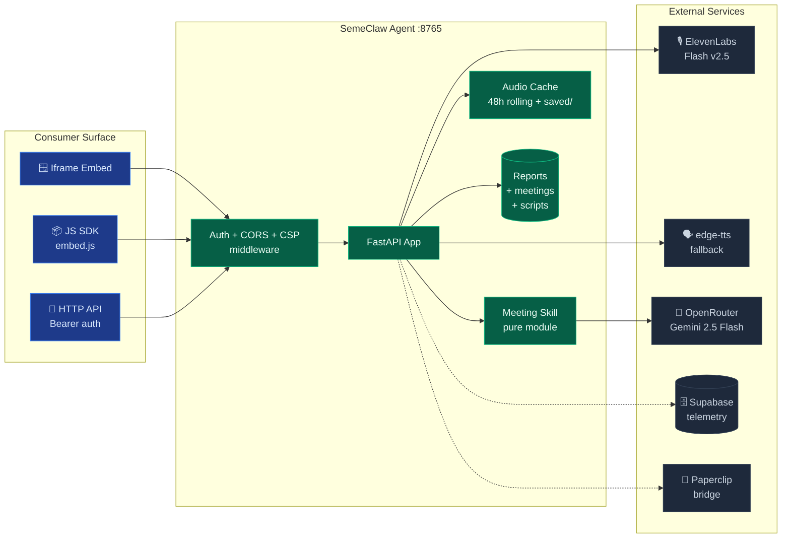
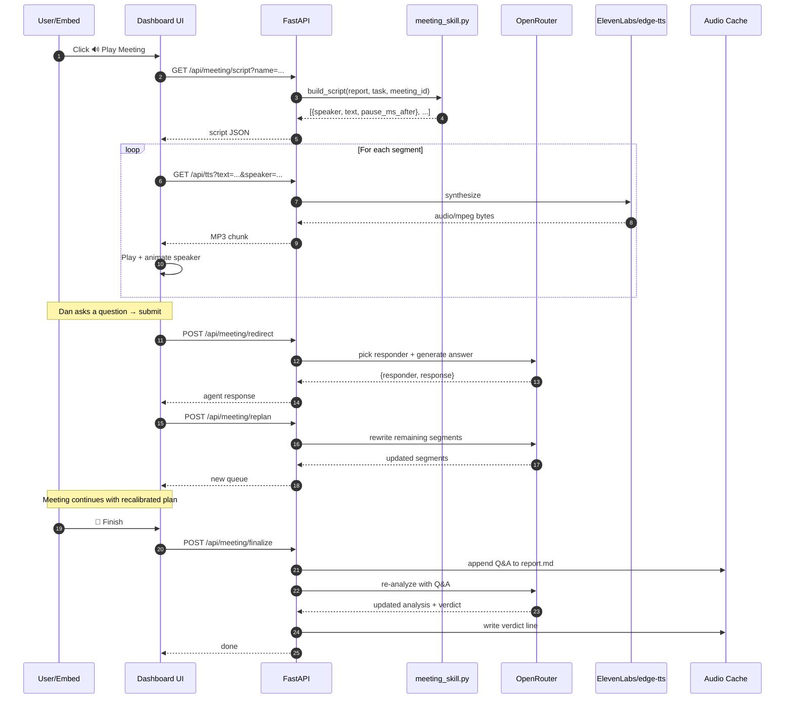
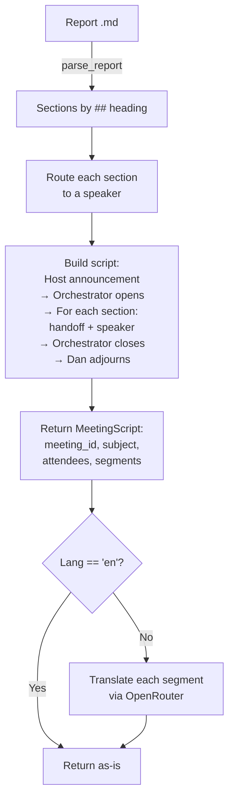

# SemeClaw Architecture

## System Overview



## Request Flow — "Play a meeting"



## Storage Model

```
war_room/
├── research/
│   ├── saved/                     ← pinned reports, never deleted
│   │   └── <task-slug>.md
│   └── <task-slug>.md             ← rolling, 48h TTL
├── audio/
│   ├── meetings/
│   │   ├── saved/                 ← pinned audio, never deleted
│   │   │   └── <meeting_id>_<slug>.mp3
│   │   └── <meeting_id>_<slug>.mp3  ← rolling, 48h TTL
│   ├── scripts/                   ← cached translated scripts (future)
│   └── segments/                  ← per-speaker segment cache (future)
└── logs/
    ├── dashboard.log
    └── dashboard-err.log
```

Retention is enforced by a background task (`_prune_old()`) that runs hourly and also on every `/api/meeting/list` + `/api/reports` call. Files under `saved/` are bypassed.

## Meeting Script Pipeline



The skill is a **pure module** with no HTTP dependencies — unit-testable, reusable from CLI, CLI, Slack bot, etc.

## Auth Model

```
┌──────────────────────────────────────────────────┐
│ SEMECLAW_API_KEY unset      → open mode (dev)    │
│ SEMECLAW_API_KEY set        → bearer required    │
│                                on WRITE endpoints│
└──────────────────────────────────────────────────┘

READ endpoints (always open):
  GET /api/agent/manifest
  GET /api/agent/health
  GET /api/reports
  GET /api/reports/content
  GET /api/meeting/script
  GET /api/meeting/audio
  GET /api/meeting/list
  GET /api/tts
  GET /embed
  GET /embed.js

WRITE endpoints (bearer when key set):
  POST /api/meeting/pin
  POST /api/meeting/unpin
  POST /api/meeting/finalize
  POST /api/meeting/replan
  POST /api/meeting/redirect
```

Reads stay open so iframe embeds work without exposing the key to the browser. Writes are protected so only trusted servers can mutate state.

## Layout V1 vs V2

### V1 — Flat (default)

```
┌──────────────────────────────────────────────────┐
│  MEETING XXX — TASK SUBJECT     🇺🇸 🔊 ⏳ 📋 ✕  │
├──────────────────────────────────────────────────┤
│  👤 Dan   🏛 David   📐 GSD  ✍️ Hermes  🔬 ...   │  ← avatars flex-row
├──────────────────────────────────────────────────┤
│  Speaker ▸ ▯▯▯▯▯▯▯▯                    🔊 Voice │  ← waveform
├──────────────────────────────────────────────────┤
│  💬 Narrator: This meeting is number...          │  ← transcript
│  💬 David:    Thanks. Let's dig in...            │
│  💬 GSD:      My take is...                      │
│                                                  │
├──────────────────────────────────────────────────┤
│  💬 [Ask up to 2 questions…]  Send(2)   🏁Finish│
└──────────────────────────────────────────────────┘
```

### V2 — Orbital (opt-in)

```
┌──────────────────────────────────────────────────┐
│  MEETING XXX                   🇺🇸 🔊 ⏳ 📋 ✕   │
├──────────────────────┬───────────────────────────┤
│       ◉ THE ROOM     │ 💬 Narrator: This meeting │
│                      │    is number 75f6809d...  │
│         👤 Dan       │                           │
│                      │ 🏛 David: Thanks for the  │
│   🔬          🏛     │    intro. Let's get into  │
│ Autores      David   │    it.                    │
│                      │                           │
│        ┌─────┐       │ 📐 GSD: Based on current  │
│        │ ◉   │       │    public info, NERVIX    │
│        │David│       │    isn't a widely recog…  │
│        └─────┘       │                           │
│   ✍️          📐     │                           │
│ Hermes        GSD    │                           │
│                      │                           │
│         🧪 Auto      │                           │
│                      │                           │
│          ← Back V1   │ 💬 [...] Send(2) 🏁Finish │
└──────────────────────┴───────────────────────────┘
```

Agents arranged in a 360° ring. The center **LIVE SPEAKER card** morphs in real-time to show the current speaker's emoji, name, and color.

## Tech Stack

| Layer | Tech |
|-------|------|
| Runtime | Python 3.10+ minimum, 3.13 recommended + uvicorn |
| Web framework | FastAPI |
| Frontend | Vanilla HTML + JS (no build step) |
| Voice TTS | ElevenLabs Flash v2.5 → edge-tts fallback |
| Audio concat | ffmpeg |
| LLM | OpenRouter (Gemini 2.5 Flash) |
| Storage | Filesystem (for meetings + reports) |
| Telemetry (opt) | Supabase |
| Deploy | Docker + launchd (dev) |
